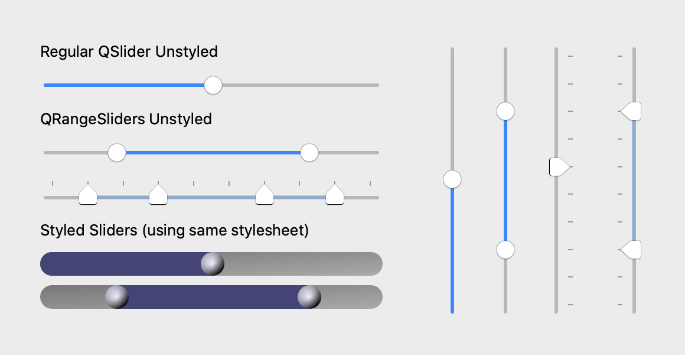
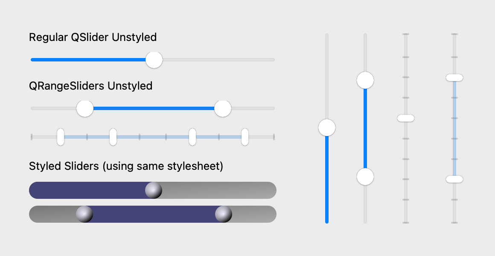
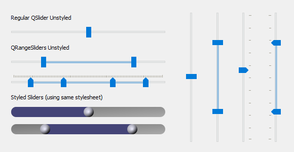
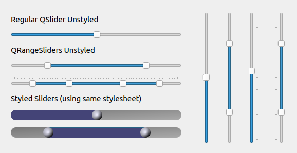

# Sliders


- `QRangeSlider` inherits from [`QSlider`](https://doc.qt.io/qt-5/qslider.html)
  and attempts to match the Qt API as closely as possible
- Uses platform-specific styles (for handle, groove, & ticks) but also supports
  QSS style sheets.
- Supports mouse wheel and keypress (soon) events
- Supports more than 2 handles (e.g. `slider.setValue([0, 10, 60, 80])`)

------

## Range Slider

```python
from qt_extras import QRangeSlider

# as usual:
# you must create a QApplication before create a widget.
range_slider = QRangeSlider()
```

As `QRangeSlider` inherits from `QtWidgets.QSlider`, you can use all of the
same methods available in the [QSlider API](https://doc.qt.io/qt-5/qslider.html).  The major difference is that `value` and `sliderPosition` are reimplemented as `tuples` of `int` (where the length of the tuple is equal to the number of handles in the slider.)

### `value: Tuple[int, ...]`

This property holds the current value of all handles in the slider.

The slider forces all values to be within the legal range:
`minimum <= value <= maximum`.

Changing the value also changes the sliderPosition.

##### Access Functions:

```python
range_slider.value() -> Tuple[int, ...]
```

```python
range_slider.setValue(val: Sequence[int]) -> None
```

##### Notifier Signal:

```python
valueChanged(Tuple[int, ...])
```

### `sliderPosition: Tuple[int, ...]`

This property holds the current slider positions.  It is a `tuple` with length equal to the number of handles.

If [tracking](https://doc.qt.io/qt-5/qabstractslider.html#tracking-prop) is enabled (the default), this is identical to [`value`](#value--tupleint-).

##### Access Functions:

```python
range_slider.sliderPosition() -> Tuple[int, ...]
```

```python
range_slider.setSliderPosition(val: Sequence[int]) -> None
```

##### Notifier Signal:

```python
sliderMoved(Tuple[int, ...])
```

### Additional properties

These options are in addition to the Qt QSlider API, and control the behavior of the bar between handles.

| getter               | setter                                      | type   | default | description                                                                                      |
| -------------------- | ------------------------------------------- | ------ | ------- | ------------------------------------------------------------------------------------------------ |
| `barIsVisible`       | `setBarIsVisible` <br>`hideBar` / `showBar` | `bool` | `True`  | <small>Whether the bar between handles is visible.</small>                                       |
| `barMovesAllHandles` | `setBarMovesAllHandles`                     | `bool` | `True`  | <small>Whether clicking on the bar moves all handles or just the nearest</small>                 |
| `barIsRigid`         | `setBarIsRigid`                             | `bool` | `True`  | <small>Whether bar length is constant or "elastic" when dragging the bar beyond min/max.</small> |
------

### Examples

These screenshots show `QRangeSlider` (multiple handles) next to the native `QSlider`
(single handle). With no styles applied, `QRangeSlider` will match the native OS
style of `QSlider` – with or without tick marks.  When styles have been applied
using [Qt Style Sheets](https://doc.qt.io/qt-5/stylesheet-reference.html), then
`QRangeSlider` will inherit any styles applied to `QSlider` (since it inherits
from QSlider).  If you'd like to style `QRangeSlider` differently than `QSlider`,
then you can also target it directly in your style sheet.  The one "special"
property for QRangeSlider is `qproperty-barColor`, which sets the color of the
bar between the handles.

> The code for these example widgets is [here](examples/demo_widget.py)

<details>

<summary><em>See style sheet used for this example</em></summary>

```css
/*
Because QRangeSlider inherits from QSlider, it will also inherit styles
*/
QSlider {
    min-height: 20px;
}

QSlider::groove:horizontal {
    border: 0px;
    background: qlineargradient(x1:0, y1:0, x2:1, y2:1,
                                stop:0 #777, stop:1 #aaa);
    height: 20px;
    border-radius: 10px;
}

QSlider::handle {
    background: qradialgradient(cx:0, cy:0, radius: 1.2, fx:0.5,
                                fy:0.5, stop:0 #eef, stop:1 #000);
    height: 20px;
    width: 20px;
    border-radius: 10px;
}

/*
"QSlider::sub-page" is the one exception ...
(it styles the area to the left of the QSlider handle)
*/
QSlider::sub-page:horizontal {
    background: #447;
    border-top-left-radius: 10px;
    border-bottom-left-radius: 10px;
}

/*
for QRangeSlider: use "qproperty-barColor".  "sub-page" will not work.
*/
QRangeSlider {
    qproperty-barColor: #447;
}
```

</details>

#### macOS

##### Catalina



##### Big Sur



#### Windows



#### Linux



## Labeled Sliders

This package also includes two "labeled" slider variants. One for `QRangeSlider`, and one for the native `QSlider`:

### `QLabeledRangeSlider`


```python
from qt_extras import QLabeledRangeSlider
```

This has the same API as `QRangeSlider` with the following additional options:

#### `handleLabelPosition`/`setHandleLabelPosition`

Where/whether labels are shown adjacent to slider handles.

**type:** `QLabeledRangeSlider.LabelPosition`

**default:** `LabelPosition.LabelsAbove`

*options:*

- `LabelPosition.NoLabel` (no labels shown adjacent to handles)
- `LabelPosition.LabelsAbove`
- `LabelPosition.LabelsBelow`
- `LabelPosition.LabelsRight` (alias for `LabelPosition.LabelsAbove`)
- `LabelPosition.LabelsLeft` (alias for `LabelPosition.LabelsBelow`)

#### `edgeLabelMode`/`setEdgeLabelMode`

**type:** `QLabeledRangeSlider.EdgeLabelMode`

**default:** `EdgeLabelMode.LabelIsRange`

*options:*

- `EdgeLabelMode.NoLabel`: no labels shown at slider extremes
- `EdgeLabelMode.LabelIsRange`: edge labels shown the min/max values
- `EdgeLabelMode.LabelIsValue`: edge labels shown the slider range

#### fine tuning position of labels:

If you find that you need to fine tune the position of the handle labels:

- `QLabeledRangeSlider.label_shift_x`: adjust horizontal label position
- `QLabeledRangeSlider.label_shift_y`: adjust vertical label position

### `QLabeledSlider`


```python
from qt_extras import QLabeledSlider
```

(no additional options at this point)

## Issues

If you encounter any problems, please [file an issue] along with a detailed
description.

[file an issue]: https://github.com/napari/qt_extras/issues

## Float Slider

just like QSlider, but supports float values

```python
from qt_extras import QDoubleSlider
```
